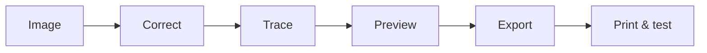
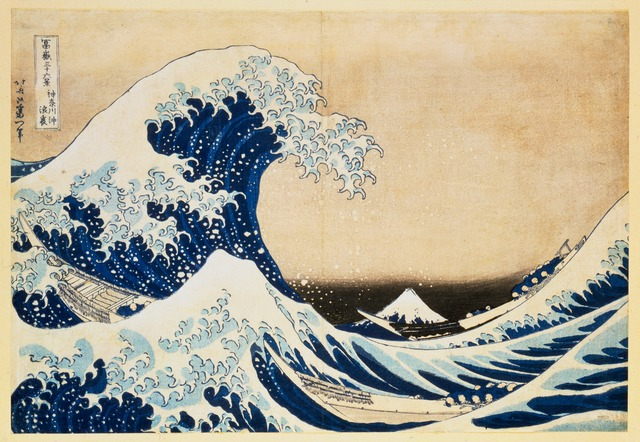

# CurvePress Studio

<div align="center">

**Make a masterpiece you can touch.**

Turn artwork into a printable relief plate with a local, beautiful, three-click workflow.

[](https://www.python.org/)
[](LICENSE)
[](https://github.com/taichiro20100723-droid/curvepress-studio/actions/workflows/test.yml)


**English · [日本語](#日本語) · [中文](#中文)**

</div>

> Start with Hokusai's *Great Wave*. In about 30 seconds, turn it into a relief plate you can preview, export, and print.
>
> **[Download the source ZIP](https://github.com/taichiro20100723-droid/curvepress-studio/archive/refs/heads/main.zip)** · **[See the showcase](docs/SHOWCASE.md)** · **[Try the examples](examples/)**

## What it does

CurvePress Studio converts artwork, line drawings, photos, and scans into raised plates designed for FDM 3D printing and physical ink transfer. It keeps the source composition in the same coordinates, turns pixels into smooth curves, and checks CAD output before you take it to a slicer.

It is deliberately local: your image is processed on your machine and is not sent to a cloud image service.

### Why CurvePress?

| Starting point | CurvePress result |
|---|---|
| A photo, scan, logo, or drawing | A curve-based printable plate |
| Faded paper or uneven lighting | Corrected contrast and thresholding |
| Fragile details | Nozzle-aware cleanup and minimum line widths |
| A quick visual experiment | Preview SVG plus STEP, 3MF, and STL exports |
| A CAD file you do not want to trust blindly | STEP reload and geometry checks |

### From image to plate



## Highlights

- Five practical styles: woodcut, line art, photo halftone, poster, and 2–6 color separation
- Browser input for JPG, PNG, WebP, GIF, BMP, AVIF, and SVG
- Automatic paper-color, white-balance, lighting, and local-contrast correction
- Optional scan-frame removal, small-island removal, hole filling, and printability cleanup
- Nozzle-aware minimum line width, gap, margin, and curve tolerance
- Consistent cubic Bézier curves in SVG and matching cubic B-spline edges in STEP
- Raised flat faces with vertical walls instead of sharp cone-shaped dots
- 15° circular halftone with density-based dot sizing
- STEP reload, BRep validity, solid-count, dimension, closed-mesh, and non-manifold checks
- Local web UI and CLI, with no image upload or external image API

## Quick start

Python 3.11 or newer is required. The CAD extra enables STEP, 3MF, and STL export.

```bash
git clone https://github.com/taichiro20100723-droid/curvepress-studio.git
cd curvepress-studio
python -m venv .venv
```

Windows PowerShell:

```powershell
.venv\Scripts\Activate.ps1
pip install -e ".[cad]"
curvepress serve
```

macOS / Linux:

```bash
source .venv/bin/activate
pip install -e '.[cad]'
curvepress serve
```

Open <http://127.0.0.1:8765>, choose an image, select a style, click **Analyze image → curves**, and export the result.

For a source checkout without the CAD dependency, use `pip install -e .` and add `--svg-only` to a CLI conversion.

## The five styles

| Style | Good starting point |
|---|---|
| **Woodcut** | Engravings, ukiyo-e-inspired artwork, and scans |
| **Line art** | Pen drawings, lettering, and logos |
| **Photo halftone** | Photos and continuous-tone shading |
| **Poster** | Bold silhouettes and high-contrast icons |
| **Color separation** | Posters and multicolor plates using 2–6 plates |

## One example worth trying

<p align="center">
  
</p>

Start with [Hokusai's *The Great Wave off Kanagawa*](examples/hokusai-great-wave.jpg) and the **Woodcut** preset for bold carved waves and clean contours.

These are compact, public-domain reproductions sourced from [Wikimedia Commons](https://commons.wikimedia.org/). They make the first run instantly recognizable while keeping the repository's demo inputs rights-cleared.

## 30-second masterpiece demo

```bash
git clone https://github.com/taichiro20100723-droid/curvepress-studio.git
cd curvepress-studio
python -m venv .venv
```

```powershell
.venv\Scripts\Activate.ps1
pip install -e ".[cad]"
curvepress convert examples/hokusai-great-wave.jpg --style woodcut --width 139 --height 83 --svg-only -o output/hokusai
```

Open `output/hokusai/` to see the curve-based SVG. For the visual workflow, run `curvepress serve`, click **Hokusai sample**, and compare **Woodcut**, **Poster**, and **Color separation** without selecting a file.

## CLI examples

```bash
curvepress convert artwork.png --style woodcut --width 139 --height 83 -o output
curvepress convert photo.jpg --style halftone --width 120 --height 80 -o output
curvepress convert poster.webp --style color_layers --colors 3 -o output
```

The command prints a JSON summary containing the job directory, warnings, metrics, and generated artifacts.

## Print starting point

For a Bambu A1 mini with a 0.4 mm nozzle, start with PLA, 0.20 mm layer height, Arachne wall generation, four walls, five top layers, no supports, and top-surface ironing. CurvePress defaults to a 0.8 mm base, 1.2 mm relief, and 2.0 mm total height for this nozzle size.

Raised artwork receives ink; low areas remain the paper color. Physical results depend on the paper, ink, roller, flatness, and pressure, so begin with a small test print. See the [printing guide](docs/PRINTING.md).

## Portable Windows bundle

The separate portable Windows bundle can include Python and the CAD runtime. Place `Start.exe` beside the `runtime` and `curvepress` folders, then double-click it. `Open_CurvePress.bat` is the visible-console fallback.

The GitHub source repository intentionally excludes the large runtime and executable. Use the source setup above, or download a portable bundle from a release asset when one is published.

## Documentation

- [Showcase and shareable project story](docs/SHOWCASE.md)
- [Printing and test-print guide](docs/PRINTING.md)
- [Algorithm and design rationale](docs/ALGORITHM.md)
- [Local API](docs/API.md)
- [Changelog](CHANGELOG.md)
- [Contributing](CONTRIBUTING.md)

## Design boundaries

CurvePress is not an AI image redrawer. It does not intentionally change the source aspect ratio, invent missing composition, or guarantee a successful physical print for every image. It simplifies geometry when details would be too small or fragile for the selected printer settings.

STEP generation uses OpenCascade and may take several minutes for complex artwork. The CAD pipeline stops above 1,600 isolated regions to avoid enormous, fragile files. Always review warnings and inspect a preview before printing.

## Development

```bash
pip install -e '.[cad,dev]'
pytest
ruff check curvepress tests
```

Issues and pull requests are welcome. Please include enough input and configuration detail to reproduce the result, while omitting images you do not have permission to share.

## 日本語

### CurvePress Studioとは

CurvePress Studioは、写真・スキャン・ロゴ・線画を、FDM方式の3Dプリンターで出力できる凹凸プレートへ変換するローカルアプリです。画像の構図を同じ座標で保ちながら、画素を滑らかな曲線に変換し、SVG・STEP・3MF・STLを出力します。

画像は自分のPC上で処理され、クラウドの画像サービスへ送信されません。

### できること

- 木版画、線画、写真ハーフトーン、ポスター、2〜6色分版の5スタイル
- JPG、PNG、WebP、GIF、BMP、AVIF、SVGの読み込み
- 紙色・ホワイトバランス・照明ムラ・局所コントラストの自動補正
- スキャン枠の除去、小さすぎる島や穴の整理、ノズル径に合わせた印刷可能性の調整
- SVGのプレビューと、STEP・3MF・STLの書き出し
- STEPの再読み込み、BRep、寸法、ソリッド数、メッシュ境界のチェック
- ブラウザーUIとコマンドラインの両方に対応

### 最短で試す

Python 3.11以上を用意し、上の **Quick start** の手順で起動してください。ブラウザーで <http://127.0.0.1:8765> を開き、画像を選択してスタイルを選び、**Analyze image → curves** を押します。

詳しい印刷条件は[印刷ガイド](docs/PRINTING.md)、処理の考え方は[アルゴリズムの説明](docs/ALGORITHM.md)を参照してください。

### 開発への参加

不具合報告や改善提案は歓迎します。画像を共有できない場合でも、画像形式・解像度・プリセット・ノズル径・警告文を添えてください。詳しくは[CONTRIBUTING.md](CONTRIBUTING.md)をご覧ください。

## 中文

CurvePress Studio 可以把照片、扫描件、线稿和海报转换成适合FDM 3D打印的浮雕版。图像在本地处理，不会上传到云端图像服务。

从 `examples/` 中选择葛饰北斋、蒙娜丽莎或《星月夜》，在网页界面点击 **Hokusai sample** 或对应的示例卡片，然后比较木刻、照片半色调和颜色分离效果。最后可以导出 SVG、STEP、3MF 和 STL。

项目支持日本語、English 和中文界面，欢迎提交 Issue 或 Pull Request。

## License

MIT License. See [LICENSE](LICENSE).

